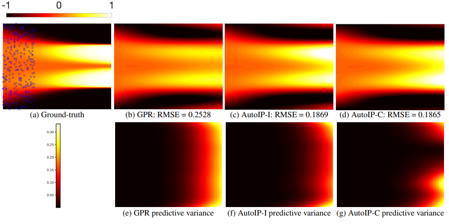

# AutoIP: A United Framework to Integrate Physics into Gaussian Processes

by Da Long, Zheng Wang, [Aditi Krishnapriyan](https://a1k12.github.io/), [Robert Kirby](https://users.cs.utah.edu/~kirby/), [Shandian Zhe](https://users.cs.utah.edu/~zhe/), [Michael Mahoney](https://www.stat.berkeley.edu/~mmahoney/)

<p align="center">
    <br>
    
    <br>
<p>


Physical modeling is critical for many modern science and engineering applications. From a data science or machine learning perspective, where more domain-agnostic, data-driven models are pervasive, physical knowledge — often expressed as differential equations — is valuable in that it is complementary to data, and it can potentially help overcome issues such as data sparsity, noise, and inaccuracy. In this work, we propose a simple, yet powerful and general framework — AutoIP, for Automatically Incorporating Physics — that can integrate all kinds of differential equations into Gaussian Processes (GPs) to enhance prediction accuracy and uncertainty quantification. These equations can be linear or nonlinear, spatial, temporal, or spatio-temporal, complete or incomplete with unknown source terms, and so on. Based on kernel differentiation, we construct a GP prior to sample the values of the target function, equation related derivatives, and latent source functions, which are all jointly from a multivariate Gaussian distribution. The sampled values are fed to two likelihoods: one to fit the observations, and the other to conform to the equation. We use the whitening method to evade the strong dependency between the sample.


# System Requirements

We implemented our model by Jax and pytorch. For Jax version, Jax and Optax --- A Jax optimizaiton library are required. For pytorch version, pytorch is required.

# Run examples

### Pendulum

* No damping:&nbsp;&nbsp;&nbsp;    
    ./Jax_version/no_damping.py or ./pytorch_version/no_damping.py
* With latent source + no damping:&nbsp;&nbsp;&nbsp;   
    ./pytorch_version/latent_no_damping.py
* Damping:&nbsp;&nbsp;&nbsp;   
    ./Jax_version/damping.py or ./pytorch_version/damping.py
* With latent source + damping:&nbsp;&nbsp;&nbsp;  
    ./pytorch_version/latent_damping.py

To run noisy data for pendulum, add "_noise" to the end. For example, to run noisy damping pendulum: use ./Jax_version/damping_noise.py or ./pytorch_version/damping_noise.py.

### Allen-Cahn

* Full equation:
    ./Jax_version/allen.py or ./pytorch_version/allen.py
* With latent source:
    ./pytorch_version/latent_allen.py

# License

IFC is released under the MIT License, please refer the LICENSE for details

# Collaborations
Feel free to contact us via `dl932@cs.utah.edu` or `u1368737@utah.edu` 


# Citation
Please cite our paper if it is helpful to you

```
@inproceedings{long2022autoip,
  title={AutoIP: A United Framework to Integrate Physics into Gaussian Processes},
  author={Long, Da and Wang, Zheng and Krishnapriyan, Aditi and Kirby, Robert and Zhe, Shandian and Mahoney, Michael},
  booktitle={International Conference on Machine Learning},
  pages={14210--14222},
  year={2022},
  organization={PMLR}
}
```
